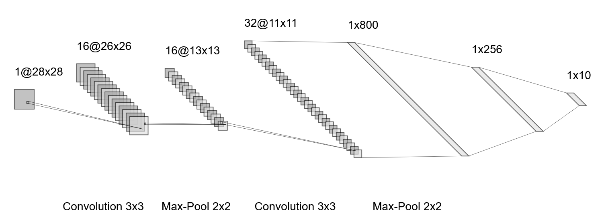

# CUDA Neural Network

Simple convolutional neural network in CUDA C++. 

## Table of Contents

- [Installation](#installation)
- [Usage](#usage)

## Installation

Download to your project directory, make sure you have the latest version of `nvcc` installed:

```sh
nvcc .\main.cu -o network.exe
```

## Usage

You can use command line to run the program with given parameters.

To configure network structure, a `layer_config_string` is used. It contains information about all layers in the network, as well as layers' properties.

Example of a config string with a visualisation:

```sh
conv_28x28x1_3_16_1_0-pool_26x26x16_2_2-conv_13x13x16_3_32_1_0-pool_11x11x32_2_2-dense_800_256-dense_256_10
```



Args list for training:
```sh
<mode (TRAIN=1)> <layer_config_string> <learning_rate> <batch_size> <epochs> <train_data_size> <test_data_size> <train_data_path> <test_data_path> <save_weights> <current_dir>
```

`<current_dir>` is where results will be saved in `./runs` subdirectory.

Args list for testing:
```sh
<mode (TEST=0)> <layer_config_string> <test_data_size> <test_data_path> <weights_path> <current_dir>
```

`<weights_path>` is the path to `.bin` file that contains weights that will be loaded and used in the model.

`<current_dir>` is where results will be saved in `./predict` subdirectory.

Example:

```sh
.\network.exe 1 "conv_28x28x1_3_16_1_0-pool_26x26x16_2_2-conv_13x13x16_3_32_1_0-pool_11x11x32_2_2-dense_800_256-dense_256_10" 0.001 128 5 60000 10000 C:/Users/YOURUSERNAME/mnist_digits_train_60000.csv C:/Users/YOURUSERNAME/mnist_digits_test_10000.csv 1 - C:/Users/YOURUSERNAME/network
```
